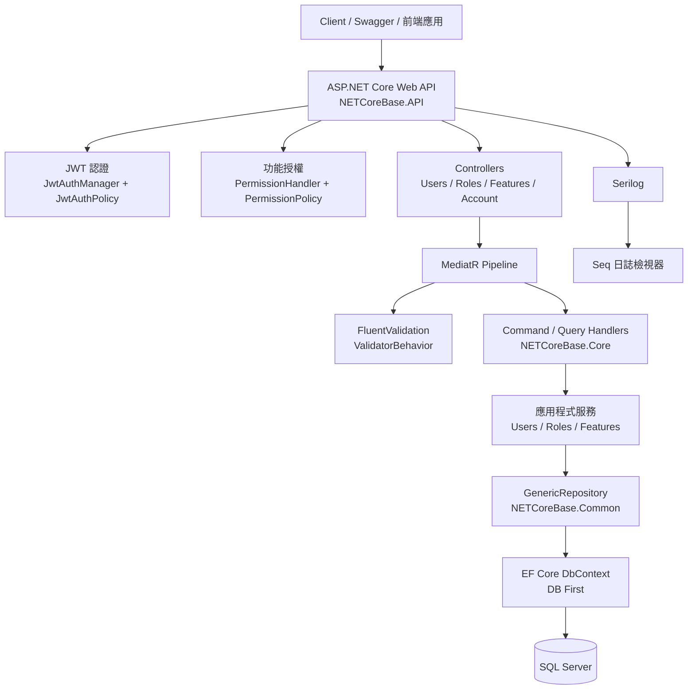

# NETCoreBase

適合企業既有系統的 ASP.NET Core API 底層專案。

這個 repository 設計給需要在不完全重寫的前提下，現代化或維護內部企業系統的團隊。它保留了熟悉的企業開發模式，包括 DB First 開發、Startup-style 設定、Autofac、MediatR、分層 Service、JWT 認證、Docker 本地執行，以及以交接為導向的文件。

目標不是成為完美的全新範本，而是提供一套實用的底層，適合現實中注重可維護性、團隊上手速度、遷移安全性和維運清晰度的企業後端系統。

---

## 這是什麼

一套實用的 ASP.NET Core Web API 底層，適合企業內部系統、對既有系統進行現代化改造，以及需要長期可維護的後端服務。

使用的技術：

- Startup-style 設定，貼近團隊習慣與企業相容性
- DB First 資料存取，整合既有企業資料庫
- Autofac DI，以模組為單位組織相依性
- MediatR，處理請求分派與關注點分離
- JWT Bearer 認證，保護 API 邊界安全
- 角色與功能層級的授權
- Docker Compose，確保本地環境可重現
- 透過 Serilog 和 Seq 進行結構化日誌

---

## 為什麼這個東西存在

許多企業後端系統不是從零開始建的。它們被擴充、遷移、交接、局部現代化，並由不斷更換的團隊維護多年。

這個 repository 探索一種底層結構：保留熟悉的企業後端模式，同時改善本地開發體驗、安全邊界、文件和維運清晰度。它不追求把所有東西改成最新框架的慣用寫法，而是問一個問題：如何讓一個現有風格的後端更容易理解、執行和交接？

---

## 什麼時候適合用這套底層

以下情況適合使用：

- 維護或現代化既有的 ASP.NET Core 企業 API
- 團隊依賴 DB First 工作流程或既有的資料庫 Schema
- 需要 JWT 認證和角色型授權
- 想要分層 Service 結構，但不引入過多抽象
- 需要 Docker-based 本地開發環境
- 需要一個更容易交接給另一個團隊的程式碼庫
- 想要一套務實的底層，用於內部系統、後台管理、工作流程 API 或整合服務

---

## 什麼時候不適合

以下情況可能不適合：

- 全新的專案且只想用 Minimal API
- 想要嚴格的 Clean Architecture 或 Vertical Slice 實作
- 想要完全 Cloud-Native 的微服務範本
- 只想用 Code First 資料庫 Migration
- 不想用 Startup-style 設定或 Autofac

---

## 架構概覽



一般 Command 的請求流程：

```
Controller → MediatR Request → ValidatorBehavior → Handler → Service → Repository → EF Core → SQL Server
```

認證透過 `JwtAuthPolicy` 全域套用。功能權限透過 `PermissionPolicy` 全域檢查。登入和註冊等公開端點使用 `[AllowAnonymous]`。

---

## 技術堆疊

| 面向 | 技術 | 說明 |
|---|---|---|
| 執行環境 | ASP.NET Core (.NET 10) | Web API 執行平台 |
| 認證 | JWT Bearer | Token-based API 認證 |
| 授權 | 自訂 Policy + PermissionHandler | 角色與功能權限模型 |
| ORM | Entity Framework Core 10 | 資料存取 |
| 資料庫方式 | DB First | 相容企業既有資料庫 |
| DI 容器 | Autofac | 以模組為單位組織相依性 |
| CQRS / 訊息 | MediatR | 請求分派與 Handler 分離 |
| 驗證 | FluentValidation | 在 MediatR Pipeline 中進行請求驗證 |
| 映射 | AutoMapper | DTO 與實體之間的映射 |
| 日誌 | Serilog | 結構化日誌輸出至 Console 和 Seq |
| 日誌檢視 | Seq | 本地日誌查詢介面 |
| 容器化 | Docker / Docker Compose | 可重現的本地環境 |
| API 文件 | Swagger / Swashbuckle | 支援 JWT 授權的 API 瀏覽器 |
| Excel 輸出 | EPPlus | Export 格式化輸出器 |
| 資料庫 | SQL Server 2022 | 主要資料儲存 |

---

## 專案結構

```text
NETCoreBase/
├── NETCoreBase.API/            # Web API 進入點
│   ├── Controllers/            # HTTP 邊界（Users、Roles、Features、Account）
│   ├── Startup.cs              # 服務註冊與 Middleware Pipeline
│   ├── Program.cs              # Host 與 Serilog 啟動
│   └── appsettings.json        # 設定檔（使用佔位密鑰）
│
├── NETCoreBase.Core/           # 應用程式邏輯層
│   ├── Commands/               # 每個 Use Case 的 MediatR Request、Handler、Validator
│   ├── Services/               # 應用程式服務實作
│   ├── Interfaces/             # 服務介面
│   ├── Profiles/               # AutoMapper 映射設定
│   └── Behaviors/              # MediatR Pipeline Behavior（驗證）
│
├── NETCoreBase.Common/         # 共用基礎設施
│   ├── Services/               # GenericRepository、JwtAuthManager、PermissionService
│   ├── Handlers/               # JWT 和功能授權 Handler
│   ├── Policies/               # 授權 Policy 需求定義
│   ├── Filter/                 # 例外 Filter、Swagger Filter
│   ├── Helpers/                # 加解密與檔案工具
│   └── Interfaces/             # Repository 和服務介面
│
├── NETCoreBase.Database/       # DB First 資料層
│   ├── Models/                 # EF Core 實體模型（Scaffold 產生）
│   ├── NETCoreBaseContext.cs   # DbContext
│   └── Schema.sql              # SQL Server Schema 建立腳本
│
├── NETCoreBase.Tests/          # 測試專案（xUnit + Moq）
│
├── doc/                        # 工程與交接文件
├── docker-compose.yml          # 本地環境：API + SQL Server + Seq
├── Dockerfile                  # 多階段建置
├── .env.example                # 本地環境變數範本
└── global.json                 # SDK 版本固定
```

### 各層說明

- `Controllers` 只處理 HTTP 邊界 — 分派給 MediatR 並回傳結果
- `Core/Commands/` 以 Use Case 為單位組織資料夾：Request、Handler、Validator、Response
- `Core/Services` 持有應用程式邏輯，由 MediatR Handler 呼叫
- `Common/GenericRepository` 提供基礎資料存取能力（EF Core）
- `Database` 中的模型由 DB First Scaffold 產生 — 不要手動編輯產生的檔案

---

## 主要功能

- JWT-based 認證，支援可設定的 issuer、audience 和過期時間
- 雙層授權：JWT Token 驗證 + 功能權限檢查
- 分層後端結構：API → Core → Common → Database
- DB First 資料存取，相容既有企業 Schema
- MediatR 請求 Pipeline，內建 FluentValidation Behavior
- Docker Compose 含 SQL Server 2022 和 Seq，適合本地開發
- Serilog 結構化請求日誌
- Excel Export 輸出格式化器
- Swagger 支援 JWT Bearer 授權
- `doc/` 目錄中有以交接為導向的工程文件

---

## 本地開發

### 事前準備

- [.NET SDK 10.0.301](https://dotnet.microsoft.com/download)（固定在 `global.json`）
- [Docker Desktop](https://www.docker.com/products/docker-desktop/)
- Docker Compose（包含在 Docker Desktop 內）

### 使用 Docker Compose 啟動

複製環境變數範本並填入本地值：

```bash
cp .env.example .env
# 編輯 .env，填入本地密鑰
```

啟動所有服務（API、SQL Server、Seq）：

```bash
docker compose up --build
```

各服務網址：

| 服務 | 網址 |
|---|---|
| API | http://localhost:8080 |
| Swagger | http://localhost:8080/swagger |
| Seq | http://localhost:5341 |
| SQL Server | localhost,1433 |

### 初始化資料庫 Schema

Docker Compose 啟動 SQL Server，但不會自動建立資料表。需手動執行 Schema 腳本：

```bash
# 複製 Schema 腳本到容器
docker cp NETCoreBase.Database/Schema.sql <db_container_id>:/home/

# 執行腳本
docker exec -it <db_container_id> /opt/mssql-tools18/bin/sqlcmd \
  -S localhost -U SA -P <your_password> -i /home/Schema.sql -C
```

詳細的 DB First 工作流程請見 `doc/database-notes.md`。

### 不用 Docker 在本地執行 API

```bash
dotnet restore
dotnet build
dotnet run --project NETCoreBase.API
```

Swagger 網址：

```text
https://localhost:5001/swagger
```

### 使用 Swagger

1. 呼叫 `POST /api/v1/Account/Login` 取得 JWT Token
2. 點擊 Swagger UI 的 **Authorize** 按鈕
3. 貼入 Token（不含引號）並確認
4. 之後即可操作所有需授權的 API

---

## 認證與授權

這套底層使用 JWT Bearer 作為主要 API 認證機制。

### 運作方式

- 所有 Controller 透過 `Startup.cs` 的 Action Filter 全域套用 `JwtAuthPolicy` 和 `PermissionPolicy`
- 需要公開存取的端點必須明確加上 `[AllowAnonymous]`（目前：Login、Register、RefreshToken）
- JWT Token 由 `JwtAuthManager` 在登入成功後發行；Refresh Token 支援一次性輪換
- 功能權限由 `PermissionHandler` 處理，根據使用者角色評估存取權

### 設定

JWT 設定從 `appsettings.json` 的 `JwtTokenConfig` 讀取：

```json
"JwtTokenConfig": {
  "Secret": "CHANGE_ME_JWT_SECRET_FOR_LOCAL_DEVELOPMENT",
  "Issuer": "https://localhost:44370/",
  "Audience": "https://localhost:44370/",
  "AccessTokenExpiration": 720,
  "RefreshTokenExpiration": 60
}
```

在 Docker Compose 中，透過環境變數覆蓋：

```yaml
JwtTokenConfig__Issuer: http://localhost:8080/
JwtTokenConfig__Audience: http://localhost:8080/
JwtTokenConfig__Secret: "${JWT_SECRET}"
```

### 授權邊界

- Token 的解析和驗證邏輯保留在 `JwtAuthManager` 和 `JwtAuthHandler`
- 功能權限評估保留在 `PermissionHandler`
- 不要把認證邏輯散落到業務 Service 中
- 角色名稱和功能權限規則請記錄在 `doc/` 中

---

## 資料庫方式

這個 repository 支援 DB First 工作流程。

在許多企業系統中，資料庫 Schema 早在應用程式現代化之前就存在了。DB First 在這裡保留，是為了支援後端服務需要整合既有資料庫、舊系統 Schema、報表限制或企業共用資料模型的場景。

這是刻意的取捨。對全新系統，Code First Migration 可能更適合。對現代化改造和交接頻繁的系統，DB First 可以降低遷移風險並保持 Schema 相容性。

`NETCoreBase.Database/Models/` 中的 EF Core 模型從 Schema Scaffold 產生。資料庫 Schema 變更後，使用 `doc/database-notes.md` 中的 Scaffold 指令重新產生。

Schema 建立腳本在 `NETCoreBase.Database/Schema.sql`。這個腳本會 DROP 並重建資料庫 — 只用於初始建立或本地開發環境。

---

## 設定與密鑰

不要將正式密鑰 commit 到這個 repository。

公開 repository 中的 `appsettings.json` 只包含佔位值（`CHANGE_ME_...`）。真實的值應來自：

- 本地 `.env` 檔案（透過 `.gitignore` 排除在 git 之外）
- Docker Compose 環境變數注入
- 部署平台的 Secret Manager
- `appsettings.Development.json`（用於非 Docker 的本地執行，同樣排除在 git 之外）

執行前必須替換的設定值：

| 金鑰 | 說明 |
|---|---|
| `ConnectionStrings:DefaultConnection` | SQL Server 連線字串 |
| `JwtTokenConfig:Secret` | JWT 簽名 Secret — 請使用長隨機字串 |
| `AesIV` | AES 初始化向量 |
| `AesKey` | AES 加密金鑰 |
| `PushDecode` | Push 通知解密金鑰 |
| `MailConfig:UserName` / `UserPass` | 若啟用郵件功能的 SMTP 憑證 |
| `SeqUrl` | Seq 日誌伺服器網址 |

從 `.env.example` 開始：

```bash
cp .env.example .env
```

---

## 交接說明

這個 repository 以交接為前提撰寫。

新接手的維護者應能僅靠程式碼和文件理解以下事項：

- API 如何啟動、進入點在哪（`Program.cs` → `Startup.cs`）
- 認證在哪裡設定（`Startup.cs`、`JwtAuthManager`、`JwtAuthHandler`）
- 資料庫存取的結構（DB First、`GenericRepository`、`NETCoreBaseContext`）
- 驗證在哪裡進行（FluentValidation 透過 MediatR Pipeline 的 `ValidatorBehavior`）
- 如何查看日誌（Serilog → Seq，http://localhost:5341）
- 如何在本地執行系統（Docker Compose 或 `dotnet run`）
- 哪些部分刻意保留了傳統相容性及其原因（見 `doc/architecture-decisions.md`）
- 哪些部分在正式環境前需要審查（見 `doc/production-considerations.md`）

詳細的結構化上手清單請見 `doc/handover-checklist.md`。

---

## 正式環境注意事項

這個 repository 是底層基礎專案，正式環境使用前需要審查以下重點：

- 替換所有 `CHANGE_ME_...` 佔位密鑰
- 審查 JWT 簽名金鑰長度和來源
- 將 CORS 政策從全開（`AllowAnyOrigin`）改為明確的來源允許清單
- 正式環境停用 Swagger
- 將 SHA1 密碼雜湊替換為適當的密碼雜湊器（例如 ASP.NET Core Identity `PasswordHasher`）
- 定義資料庫備份與還原策略
- 設定結構化日誌保留和告警

詳細清單請見 `doc/production-considerations.md`。

---

## 開發路線

開發路線分為五個階段，從公開準備到架構精進逐步推進：

1. **公開準備** — 密鑰替換、文件完整（已完成）
2. **可執行環境** — Health Check、DB 初始腳本、啟動確認清單
3. **安全強化** — 密碼雜湊器、CORS 政策、JWT 驗證改善
4. **測試與品質** — 單元與整合測試、格式化、漏洞掃描
5. **架構整理** — 層級邊界改善、錯誤回應標準化

詳細路線請見 `doc/roadmap.md`。

---

## 文件

工程和交接文件放在 `doc/`：

| 檔案 | 說明 |
|---|---|
| `doc/system-analysis.md` | 系統角色、功能需求與資料範圍 |
| `doc/system-design.md` | 分層責任、請求流程與設計決策 |
| `doc/base-framework-plan.md` | 底層規劃與範圍 |
| `doc/project-notes.md` | 分層說明、常見流程、容易找錯位置的地方 |
| `doc/roadmap.md` | 分階段整理路線 |
| `doc/operation-and-security.md` | 安全性與維運清單 |
| `doc/api-notes.md` | Controller 和 API 使用說明 |
| `doc/database-notes.md` | DB First Scaffold 工作流程與 Schema 說明 |
| `doc/handover-checklist.md` | 新接手維護者的逐項確認清單 |
| `doc/production-considerations.md` | 正式環境上線前需審查的項目 |
| `doc/architecture-decisions.md` | 主要架構決策及其理由 |
| `doc/net10-upgrade.md` | .NET 10 升級時的異動紀錄 |
| `doc/net8-upgrade.md` | .NET 8 升級的歷史紀錄 |

---

## GitHub Repository 設定

建議的 Repository 描述（用於 GitHub 設定頁面）：

```
適合企業內部系統的 ASP.NET Core 底層：JWT 認證、DB First、Docker、分層架構，以交接為導向。
```

建議的 Topics：

```
aspnet-core dotnet enterprise-architecture web-api jwt-authentication ef-core db-first
autofac mediatr fluentvalidation docker sql-server legacy-modernization
```

---

## 授權

這個 repository 目前不含授權檔案。如果打算作為公開底層專案使用，請考慮加入適當的開源授權（MIT、Apache 2.0）或內部使用限制說明。
